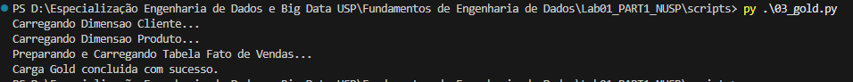
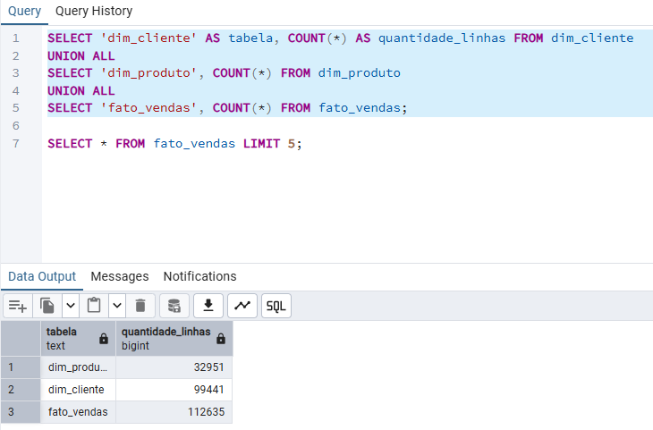

# Laboratório 01-A: Ingestão de Dados End-to-End (Local)

Projeto de engenharia de dados focado na construção de uma pipeline Medallion Architecture (Bronze, Silver, Gold). O processo extrai dados brutos do e-commerce Olist, aplica limpeza com Pandas e carrega as tabelas finais em um banco PostgreSQL estruturado em Star Schema.

## 1. Arquitetura do Projeto

O fluxo de dados segue três etapas isoladas:
- **Camada Bronze:** Extração dos arquivos CSV originais da fonte e armazenamento local sem alterações na pasta `data/raw/`.
- **Camada Silver:** Leitura com Pandas, remoção de duplicatas, conversão de datas e limpeza de nulos. Os dados são salvos em formato Parquet na pasta `data/silver/` para otimização de espaço e tipagem.
- **Camada Gold:** Leitura dos arquivos Parquet via SQLAlchemy e ingestão no PostgreSQL. O banco adota um modelo Star Schema (Tabela Fato central cercada por Tabelas de Dimensões).

Fluxo visual: Fontes CSV -> Python (Pandas) -> Arquivos Parquet -> Python (SQLAlchemy) -> PostgreSQL.

## 2. Documentação da Tarefa

A execução ocorreu de forma sequencial. A limpeza removeu registros inconsistentes e as consultas validaram os totais inseridos.

[PRINT DO TERMINAL EXECUTANDO OS SCRIPTS]


[PRINT DO PGADMIN COM A CONTAGEM DAS TABELAS]


A análise exploratória gerou métricas visuais sobre o comportamento da base na camada Silver.


## 3. Dicionário de Dados (Camada Gold)

O banco PostgreSQL possui três tabelas principais.

**Tabela: dim_cliente**
- customer_id (VARCHAR): Chave primária do cliente.
- customer_unique_id (VARCHAR): Identificador único do cliente.
- customer_zip_code_prefix (INT): CEP do cliente.
- customer_city (VARCHAR): Cidade do cliente.
- customer_state (VARCHAR): Estado do cliente.

**Tabela: dim_produto**
- product_id (VARCHAR): Chave primária do produto.
- product_category_name (VARCHAR): Nome da categoria.
- product_weight_g (FLOAT): Peso em gramas.
- product_length_cm (FLOAT): Comprimento.
- product_height_cm (FLOAT): Altura.
- product_width_cm (FLOAT): Largura.

**Tabela: fato_vendas**
- order_id (VARCHAR): Identificador do pedido.
- order_item_id (INT): Sequencial do item no pedido.
- product_id (VARCHAR): Chave estrangeira do produto.
- customer_id (VARCHAR): Chave estrangeira do cliente.
- seller_id (VARCHAR): Identificador do vendedor.
- price (FLOAT): Valor do produto.
- freight_value (FLOAT): Valor do frete.
- order_purchase_timestamp (TIMESTAMP): Data e hora da compra.
- order_status (VARCHAR): Status de entrega do pedido.

## 4. Qualidade de Dados

A base original apresentou problemas tratados na etapa Silver:
- **Nomes de colunas:** Os arquivos já adotavam o padrão snake_case. Nenhuma conversão adicional foi necessária neste aspecto.
- **Tipagem de datas:** Colunas de tempo vieram como texto (strings). O código forçou a conversão para `datetime` nativo.
- **Valores ausentes:** A tabela de pedidos continha linhas sem a data de aprovação (`order_approved_at`). A regra de negócio descartou esses registros incompletos usando a função `dropna`.
- **Integridade referencial:** As tabelas Fato e Dimensões foram carregadas sem restrições rígidas de FOREIGN KEY para evitar bloqueios causados por registros órfãos na base pública.

## 5. Instruções de Execução

Siga os passos abaixo para reproduzir o ambiente na sua máquina.

1. Clone o repositório.
2. Crie um arquivo `.env` na raiz e insira suas credenciais do PostgreSQL (DB_USER, DB_PASS, DB_HOST, DB_PORT, DB_NAME).
3. Instale as dependências:
   `pip install -r requirements.txt`
4. Crie o banco de dados `olist_gold` e as tabelas via pgAdmin usando o script SQL fornecido na documentação interna.
5. Execute a pipeline na ordem:
   - `python scripts/01_bronze.py`
   - `python scripts/02_silver.py`
   - `python scripts/gerar_eda.py`
   - `python scripts/03_gold.py`

## 6. Métricas de Negócio (Consultas SQL)

As queries abaixo respondem às regras de negócio exigidas no laboratório.

**1. Faturamento Total e Quantidade Vendida por Categoria**
```sql
SELECT
    dp.product_category_name AS categoria_produto,
    COUNT(fv.order_item_id) AS quantidade_itens_vendidos,
    ROUND(SUM(fv.price)::numeric, 2) AS faturamento_total
FROM fato_vendas fv
JOIN dim_produto dp ON fv.product_id = dp.product_id
WHERE dp.product_category_name IS NOT NULL
GROUP BY dp.product_category_name
ORDER BY faturamento_total DESC
LIMIT 10;

2. Categoria com Maior Faturamento no Estado de São Paulo

SELECT
    dp.product_category_name AS categoria_produto,
    ROUND(SUM(fv.price)::numeric, 2) AS faturamento_sp
FROM fato_vendas fv
JOIN dim_produto dp ON fv.product_id = dp.product_id
JOIN dim_cliente dc ON fv.customer_id = dc.customer_id
WHERE dc.customer_state = 'SP' AND dp.product_category_name IS NOT NULL
GROUP BY dp.product_category_name
ORDER BY faturamento_sp DESC
LIMIT 1;

3. Ticket Médio por Estado Brasileiro

SELECT
    dc.customer_state AS estado,
    COUNT(DISTINCT fv.order_id) AS total_pedidos,
    ROUND(SUM(fv.price)::numeric, 2) AS faturamento_total,
    ROUND((SUM(fv.price) / COUNT(DISTINCT fv.order_id))::numeric, 2) AS ticket_medio
FROM fato_vendas fv
JOIN dim_cliente dc ON fv.customer_id = dc.customer_id
GROUP BY dc.customer_state
ORDER BY ticket_medio DESC;

4. Os 10 Produtos Individuais Mais Rentáveis

SELECT
    fv.product_id,
    dp.product_category_name AS categoria,
    COUNT(fv.order_item_id) AS qtd_vendida,
    ROUND(SUM(fv.price)::numeric, 2) AS receita_total
FROM fato_vendas fv
JOIN dim_produto dp ON fv.product_id = dp.product_id
GROUP BY fv.product_id, dp.product_category_name
ORDER BY receita_total DESC
LIMIT 10;

5. Custo Médio e Custo Total de Frete por Estado

SELECT
    dc.customer_state AS estado,
    ROUND(AVG(fv.freight_value)::numeric, 2) AS custo_medio_frete,
    ROUND(SUM(fv.freight_value)::numeric, 2) AS custo_total_frete
FROM fato_vendas fv
JOIN dim_cliente dc ON fv.customer_id = dc.customer_id
GROUP BY dc.customer_state
ORDER BY custo_medio_frete DESC;